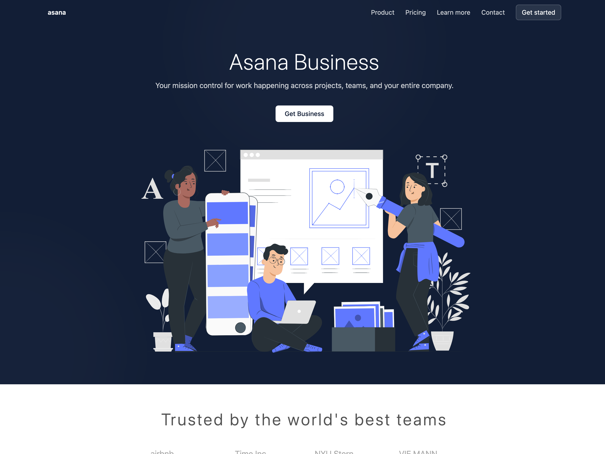
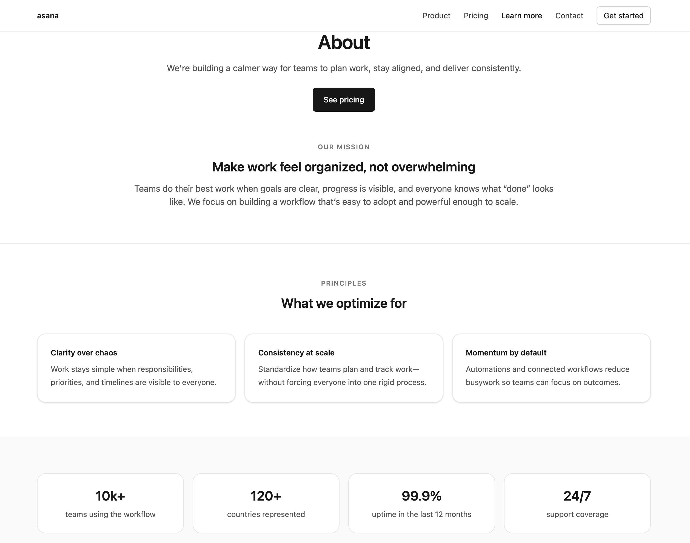
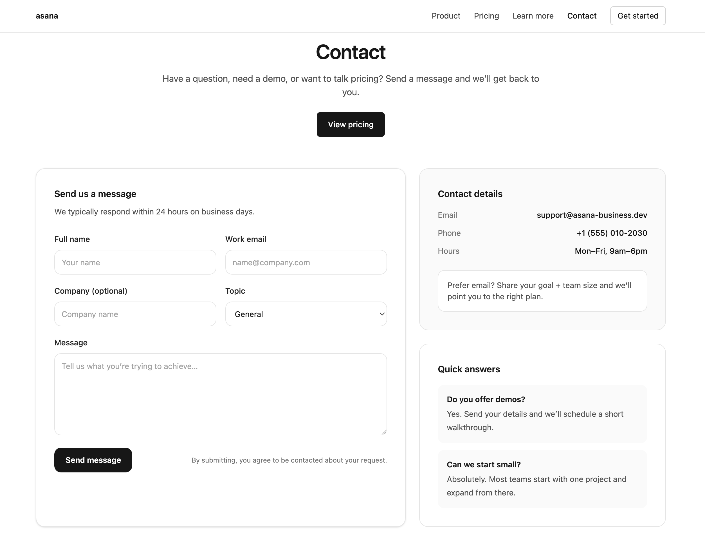
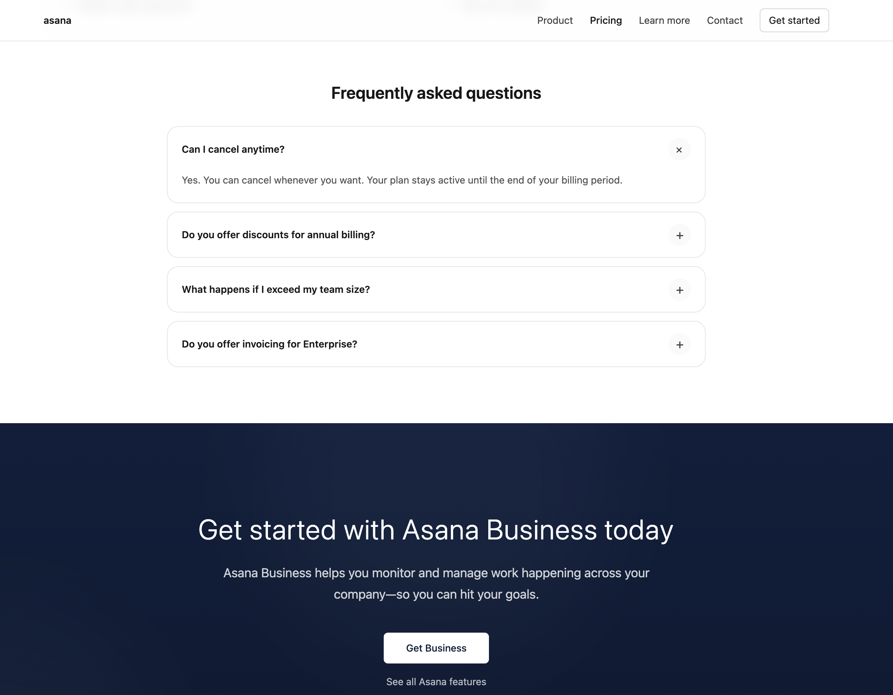
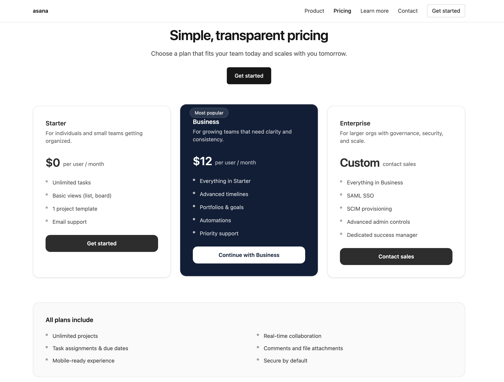

# Asana Business — SaaS Marketing Website (Frontend)

A fully responsive, multi-page **SaaS marketing website** inspired by modern productivity tools.  
Built with a strong focus on **UI/UX, conversion flow, and real-world frontend functionality** — without a backend or dashboard.

Live Demo: https://asana-saa-s-steel.vercel.app/
Repository: https://github.com/SubDan12/Asana-SaaS

---

## Screenshots

---

## Overview

This project demonstrates how a modern SaaS marketing website should **look, feel, and behave** from a frontend perspective.

It includes:

- Clear product storytelling
- Interactive pricing flow
- Real contact form submission
- Polished mobile & desktop UX
- Clean component architecture

This is a **frontend-only project** by design — no backend, auth, or dashboard is included.

---

## Pages Included

- **Home** — Product overview and value proposition
- **Features** — Detailed product capabilities and use cases
- **Pricing** — Interactive pricing cards with plan selection
- **About** — Mission, principles, and product philosophy
- **Contact** — Real contact form with Formspree integration

---

## Key Features

### Interactive Pricing Flow

- Select a pricing plan (Starter / Business / Enterprise)
- Selected plan is visually highlighted
- Plan selection persists using `localStorage`
- Clicking “Continue” routes users to the Contact page with the plan pre-filled

### Real Contact Form (Formspree)

- Connected to **Formspree** for real submissions
- Loading, success, and error states
- Selected pricing plan included in submission data
- No page redirect — smooth UX

### FAQ Accordion

- Expand/collapse FAQ items
- Smooth animation using Framer Motion
- Reusable accordion component

### Responsive Navigation

- Desktop navbar + mobile menu
- Active routes
- Smooth UX across breakpoints

---

## Tech Stack

- **React** (Vite)
- **React Router** (client-side routing)
- **Tailwind CSS v4**
- **Framer Motion** (animations & accordion)
- **Formspree** (contact form backend)
- **Vercel** (deployment)

---

## Project Structure

src/
├── app/
│ ├── AppRouter.jsx
│ └── Layout.jsx
│
├── components/
│ ├── Navbar.jsx
│ ├── PageHeader.jsx
│ ├── PricingCard.jsx
│ ├── FAQAccordion.jsx
│ ├── FeatureRow.jsx
│ ├── TintedBand.jsx
│ ├── FinalCTA.jsx
│ └── motion/
│ └── Reveal.jsx
│
├── pages/
│ ├── Home.jsx
│ ├── Features.jsx
│ ├── Pricing.jsx
│ ├── About.jsx
│ └── Contact.jsx
│
└── main.jsx

## What This Project Demonstrates

- Building **conversion-focused SaaS marketing sites**
- Component-driven architecture
- Managing UI state without a backend
- Real third-party integration (Formspree)
- Responsive & accessible design
- Clean, scalable frontend patterns

---

## What This Project Does NOT Include

- No authentication
- No dashboard
- No backend APIs
- No payments

> These were intentionally excluded to keep the project focused on **frontend excellence** and avoid fake or misleading functionality.
